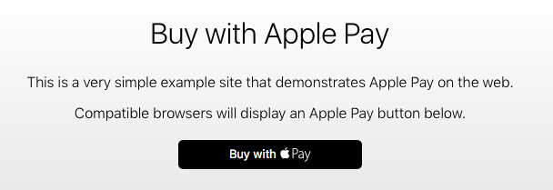
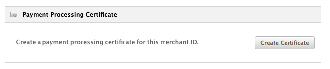
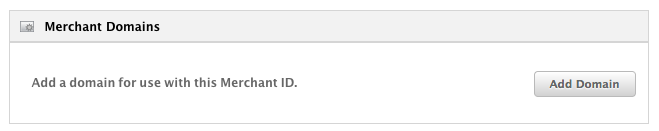
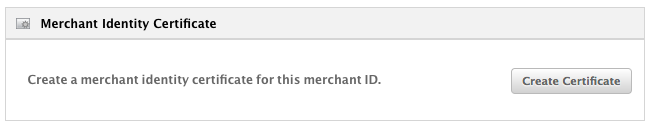
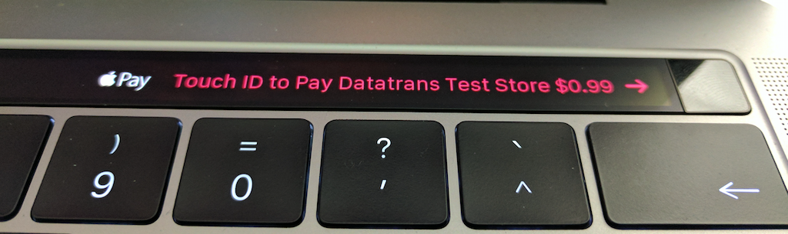

# Apple Pay Web Sample App
This small Spring Boot App demonstrates a basic Apple Pay Web integration with Datatrans.
Use it as a step by step guide to get started with Apple Pay on the web.

Demo: [https://applepay-datatrans-sample.herokuapp.com](https://applepay-datatrans-sample.herokuapp.com)



## What you need
1. [A Datatrans test merchantId](https://www.datatrans.ch/en/technics/test-account) and access
to the [webadmin tool](https://pilot.datatrans.biz/)
2. [An apple developer account](https://developer.apple.com/account/)
3. Java installed on your local dev system
4. `openssl` installed on your local dev system
5. A domain. For example my-weird-shop.com
6. An Apple Pay ready iPhone or a late 2016 MacBook Pro with Touchbar
7. A credit card from an issuer (bank) supporting ApplePay
8. A [Heroku](https://www.heroku.com) account if you want to deploy this sample application
9. Experience with the ['Getting Started on Heroku with Java'](https://devcenter.heroku.com/articles/getting-started-with-java#define-config-vars) Guide

## Initial Apple Pay Web setup
1. [Create a new merchantId](https://developer.apple.com/account/ios/identifier/merchant/create) on developer.apple.com
2. Click on the 'Edit' button of the newly created merchantId
3. Here you see 3 'boxes'
   1. Payment Processing Certificate
   
        
    
        This is the certificate you need to upload in the Datatrans [webadmin tool](https://pilot.datatrans.biz/). 
        But first a CSR needs to be created. For this (also in the webadmin tool), navigate to 'UPP Administration' > 'UPP Security' >
        'Apple Pay key and certificate' fill in the details for 'Certificate subject DN' 
        and click the 'Generate new key' button. Now download the CSR and use it to create the payment processing
        certificate. Finally, again in the webadmin tool, upload & import the certificate.
        
        Side note: Once you completed this step you should be ready to perform Apple Pay (not Web) transactions
        with the [Datatrans iOS Mobile Library](https://pilot.datatrans.biz/showcase/doc/iOS_Developers_Manual.pdf)
        
   2. Merchant Domains
   
      
      
      Apple needs to validate your shop domain. Add your fully qualified domain name there and upload the 
       verification file as instructed. You should get your domain validated pretty easily.
         
   3. Merchant Identity Certificate
      
      
      
      This is the certificate you need to make a connection from your server to apple to do the merchant validation.
      **Do not** re-use the CSR from above here. Instead, create your own:
      
      ```zsh
      $ openssl req -sha256 -nodes -newkey rsa:2048 -keyout applepaytls.key -out applepaytls.csr
      ```
      
      Use `applepaytls.csr` to create your merchant identity certificate. 
      
      Convert the downloaded merchant identity certificate to `.pem`
      
      ```zsh
      $ openssl x509 -inform der -in certFromApple.cer -out merchant_identity_cert.pem
      ```
      
      And finally create a `.p12` file
      
      ```zsh
      $ openssl pkcs12 -export -in ./merchant_identity_cert.pem -inkey ./applepaytls.key -out ./apple-pay.p12 -name "Datatrans Showcase ApplePay key"
      ```
            
## Prepare the sample application
1. Put the `apple-pay.p12` file into folder `src/main/resources/tls`
2. Adjust the `application.properties` in `src/main/resources`

   `ch.datatrans.applepay.merchantIdentifier`: The merchant identifier you used to create your merchantId
   on developer.apple.com
   
    `ch.datatrans.applepay.domainName`: The domain you used on developer.apple.com (where you uploaded
    the verification file) or the Heroku domain name assigned to you (see Deployment section). 
    
    `ch.datatrans.applepay.displayName`: Will be shown on the touchbar during a payment.
    
    
    
## Deploy to Heroku
1. Clone this repository and create the application
    
    ```zsh
    $ git clone git@github.com:datatrans/apple-pay-web-sample.git
    $ cd apple-pay-web-sample
    $ heroku create <your-app-name>
    $ git remote add heroku https://git.heroku.com/<your-app-name>.git    
    ```
    
2. Set the `$KEYSTORE_PASSWORD` config variable used in the `Procfile`. The value should be the password you
used to create the `apple-pay.p12` file.
    
    ```zsh
    $ heroku config:set KEYSTORE_PASSWORD=password
    
    ```
    
3. Push to Heroku and launch the instance
   
   ```zsh
   $ git push heroku master
   $ heroku ps:scale web=1
   $ heroku open
   ```
    


        
    
