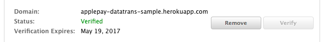
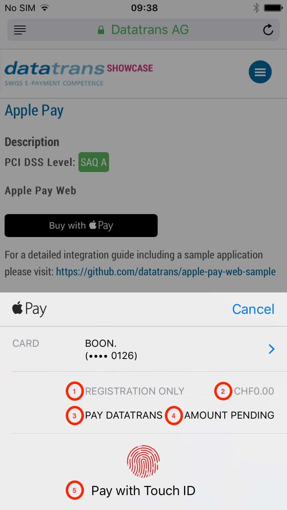

:exclamation: Deprecated! Use https://github.com/datatrans/payment-button

# Apple Pay Web Sample App
This small Spring Boot App demonstrates a basic Apple Pay Web integration with Datatrans.
Use it as a step by step guide to get started with Apple Pay on the web.

Demo: [https://applepay-datatrans-sample.herokuapp.com](https://applepay-datatrans-sample.herokuapp.com)


## What you need
1. A [Datatrans test merchantId](https://testaccount.datatrans.com/testaccounts) and access
to the [webadmin tool](http://admin.sandbox.datatrans.com)
2. An [apple developer account](https://developer.apple.com/account/) with an active membership
3. Java installed on your local dev system
4. `openssl` installed on your local dev system
5. A domain (for example my-shop.com or the one Heroku assigns to you)
6. An iPhone or MacBook with Touchbar supporting Apple Pay
7. A credit card from an issuer (bank) supporting Apple Pay
8. A [Heroku](https://www.heroku.com) account if you want to deploy this sample application
9. Experience with the ['Getting Started on Heroku with Java'](https://devcenter.heroku.com/articles/getting-started-with-java#define-config-vars) Guide

## Initial Apple Pay Web setup
1. [Create a new identifier (Merchant ID)](https://developer.apple.com/account/resources/identifiers/add/bundleId) at developer.apple.com
2. Click on the 'Edit' button of the newly created Merchant ID
3. Here you see 3 'boxes'
   1. Payment Processing Certificate
   
        
    
        This is the certificate you need to upload in the Datatrans [webadmin tool](http://admin.sandbox.datatrans.com). 
        But first a CSR needs to be created. For this (also in the webadmin tool), navigate to *'UPP Administration' > 'UPP Security' >
        'Apple Pay key and certificate'* and click the 'Download CSR file' button. Use the downloaded CSR to create a payment processing
        certificate. Finally, again in the webadmin tool, upload & import the certificate.
        
        Side note: Once you completed this step you should be ready to perform Apple Pay (not Web) transactions
        with the [Datatrans iOS Mobile Library](https://admin.sandbox.datatrans.com/showcase/doc/iOS_Developers_Manual.pdf)
        
   2. Merchant Domains
   
      
      
      Apple needs to validate your shop domain. Add your fully qualified domain name there and upload the 
       verification file as instructed (or check the 'Deploy to Heroku' section if you want to use the domain
        assigned to you by Heroku). You should get your domain validated pretty easily. You can also do this
       step later. During the deployment of the app to Heroku, you will be assigned a Domain name. This one can
       then be used for validation. For example:
       
       
         
   3. Merchant Identity Certificate
      
      
      
      This is the certificate you need to make a connection from your server to apple to do the merchant validation.
      **Do not** re-use the CSR from above here. Instead, create your own:
      
      ```zsh
      $ openssl req -sha256 -nodes -newkey rsa:2048 -keyout applepaytls.key -out applepaytls.csr
      ```
      
      Use `applepaytls.csr` to create your merchant identity certificate on developer.apple.com.
      
      Convert the downloaded merchant identity certificate to `.pem`
      
      ```zsh
      $ openssl x509 -inform der -in certFromApple.cer -out merchant_identity_cert.pem
      ```
      
      And finally create a `.p12` file
      
      ```zsh
      $ openssl pkcs12 -export -in merchant_identity_cert.pem -inkey applepaytls.key -out apple-pay.p12 -name "Datatrans Showcase ApplePay key"
      ```
            
## Prepare the sample application
1. Clone this repo
    ```zsh
    $ git clone git@github.com:datatrans/apple-pay-web-sample.git
    $ cd apple-pay-web-sample
    ```
    
2. Put the `apple-pay.p12` file into folder `src/main/resources/tls`
3. Adjust the `application.properties` in `src/main/resources`

   `ch.datatrans.applepay.merchantIdentifier`: The merchant identifier you used to create your merchantId
   on developer.apple.com
   
    `ch.datatrans.applepay.domainName`: The domain you used on developer.apple.com (where you uploaded
    the verification file) or the Heroku domain name assigned to you (see the 'Deploy to Heroku' section). 
    
    `ch.datatrans.applepay.displayName`: Will be shown on the touchbar during a payment.
    
    
    
    `ch.datatrans.merchantId`: Your Datatrans merchantId
    
    `ch.datatrans.sign`: The sign configured in the webadmin tool. Note: this sample currently
    only supports security level 1 (=static sign).
    
    
## Deploy to Heroku
1. Create the application
    
    ```zsh   
    $ heroku create <your-app-name>
    ```
    
2. Make sure to validate the domain assigned to you by Heroku on developer.apple.com. For this put a folder
with the name `.well-know` to `src/main/resources/static` 
and put the `apple-developer-merchantid-domain-association` file (downloaded from Apple) there. 

3. Set the `$KEYSTORE_PASSWORD` config variable used in the `Procfile`. The value should be the password you
used to create the `apple-pay.p12` file.
    
    ```zsh
    $ heroku config:set KEYSTORE_PASSWORD=password
    
    ```
    
4. Push to Heroku and launch the instance
   
   ```zsh
   $ git push heroku master
   $ heroku ps:scale web=1
   $ heroku open
   ```
   
## Appendix
### Testing
On your iPhone / MacBook it's the easiest if you just configure a real Apple Pay enabled credit card. Authorizations
with real cards will be declined on the [Datatrans test system](https://admin.sandbox.datatrans.com/). So don't worry,
your card will not be charged. In order to get some successful transactions, Datatrans has the following logic in place 
(only on the test system obviously):
- If a valid Apple Pay token is sent and the amount is < 500 (500 equals 5.00 USD or 5.00 CHF) we do the following replacements:
    
    cardno=4242 4242 4242 4242  
    expm=12      
    expy=21
    
- If an empty token is sent, Datatrans uses a test token with the following values:

    cardno=4242 4242 4242 4242  
    expm=12  
    expy=21  
    amount=100  
    currency=CHF
    
### Adjusting the Apple Pay payment sheet for recurring

You might have a use case were you want to do some recurring transactions. Therefore it would make
sense to adjust the Apple Pay payment sheet accordingly. Unfortunately not every part on the payment
sheet can be changed.



1. This is a free text label of a line item indicating that this is 'only' a registration
2. The amount set to 0.00. In general those line items are optional.

   ```JavaScript
   lineItems: [
     {
       label: 'Registration only',
       amount: '0.00'
     }
   ]
   ```
3. The word 'PAY' is static. 'DATATRANS' (indicating the merchant name) is again free text.
4. To get the 'AMOUNT PENDING' text the total item needs to be like:

   ```JavaScript
   total: {
     label: 'Datatrans',
     amount: '0.01',
     type: 'pending'
   }
   ```
   
   As you can see Apple Pay does not allow a total amount of 0.0. Therefore please use an amount > 0.
   
5. 'Pay with Touch ID' cannot be changed and is a hardcoded label.

Please get in touch with us if you want to do recurring payments with Apple Pay. Also please
  note that on a late 2016 MacBook Pro the Touchbar will show an amount of 0.01. There is currently
  no way of hiding the amount when using the Touchbar.
    
### Authorisation with Datatrans
Check out `src/main/java/ch/datatrans/applepay/client/DatatransClient.java` to see how the authorisation is done.

Sample request:

```XML
<?xml version="1.0" encoding="UTF-8" ?>
<authorizationService version="1">
  <body merchantId="$merchantId">
    <transaction refno="$refno">
      <request>
        <applePayToken><![CDATA[$token]]></applePayToken>
        <reqtype>NOA</reqtype>
        <transtype>05</transtype>
        <sign>$sign</sign>
      </request>
    </transaction>
  </body>
</authorizationService>
```

Sample response:

```XML
<?xml version="1.0" encoding="UTF-8" ?>
<authorizationService version="1">
  <body merchantId="$merchantId" status="accepted">
    <transaction refno="$refno" trxStatus="response">
      <request>
        <applePayToken><![CDATA[$token]]></applePayToken>
        <reqtype>NOA</reqtype>
        <transtype>05</transtype>
        <sign>$sign</sign>
      </request>
      <response>
        <responseCode>01</responseCode>
        <responseMessage>Authorized</responseMessage>
        <uppTransactionId>160823101329060450</uppTrasactionId>
        <authorizationCode>538050451</authorizationCode>
        <acqAuthorizationCode>101538</acqAuthorizationCode>
        <aliasCC>70119122433810042</aliasCC>
        <expy>18</expy>
        <expm>12</expm>
      </response>
    </transaction>
  </body>
</authorizationService>
```

A successful call will return `<body>`’s attribute `status="accepted"` and `<transaction>`’s `trxStatus="response"` as 
well as a new `<response>` element containing the responseCode. A responseCode equal to "01" or "02" indicates
an authorized transaction. Elements aliasCC, expy and expm will be returned only if the merchant uses credit card aliases.

Sample POST URL payload:

```XML
<uppTransactionService version="1">
    <body merchantId="1100006389">
        <transaction refno="1571989559867" status="success">
            <uppTransactionId>191025094600271000</uppTransactionId>
            <amount>99</amount>
            <currency>USD</currency>
            <pmethod>VIS</pmethod>
            <sourcepmethod>APL</sourcepmethod>
            <reqtype>NOA</reqtype>
            <success>
                <authorizationCode>601081003</authorizationCode>
                <acqAuthorizationCode>094601</acqAuthorizationCode>
                <responseCode>01</responseCode>
            </success>
            <userParameters>
                <parameter name="maskedCC">424242xxxxxx4242</parameter>
                <parameter name="aliasCC">70119122433810042</parameter>
                <parameter name="responseCode">01</parameter>
                <parameter name="expy">21</parameter>
                <parameter name="expm">12</parameter>
            </userParameters>
        </transaction>
    </body>
</uppTransactionService>
```

The maskedCC parameter returned here **DOES NOT** represent the actual card number of the cardholder.
With Apple Pay a virtual card number is used. Try to avoid displaying this maskedCC somewhere in
a user's profile for example.
    
### Remarks
- Please **NEVER EVER** use this code in any form in production. 
- The client side code in `src/main/resources/static` is a 1:1 copy from the
[Apple Pay Web Emporium](https://developer.apple.com/library/content/samplecode/EmporiumWeb/) with some
small adjustments to make the actual authorization with Datatrans.
- If you have questions please create an issue and add the label "question".


        
    
